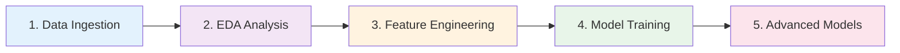

# Healthcare Cyber Risk Recommender

A machine learning system for prioritizing cybersecurity vulnerabilities in healthcare environments using Learn-to-Rank (LTR) on multi-source threat intelligence data.

## Overview

This project addresses the challenge of vulnerability prioritization in healthcare by integrating data from authoritative sources including the National Vulnerability Database (NVD), CISA Known Exploited Vulnerabilities (KEV), Exploit Prediction Scoring System (EPSS), MITRE ATT&CK framework, and healthcare-specific datasets. It employs a LambdaMART ranking model to provide context-aware prioritization that goes beyond traditional CVSS scoring.

## Features

- **Multi-Source Data Integration**: Combines NVD, KEV, EPSS, ATT&CK, CHPL, and healthcare breach data
- **Learn-to-Rank Model**: Uses LightGBM LambdaMART for ranking vulnerabilities by risk
- **Healthcare Focus**: Includes domain-specific filtering and prioritization for medical devices and systems
- **REST API**: FastAPI-based API for real-time vulnerability recommendations
- **Comprehensive Evaluation**: Temporal validation and cross-validation for robust performance assessment
- **Explainability**: SHAP-based feature importance and instance-level explanations

## Architecture

The system follows a layered architecture:

1. **Data Layer**: Integration of 6+ cybersecurity intelligence sources
2. **Feature Engineering**: 50+ engineered features including temporal, exploitation, and adversarial context
3. **Model Layer**: Confidence-weighted LambdaMART ranking model
4. **Evaluation Layer**: NDCG, Precision@K metrics with temporal holdout
5. **API Layer**: REST endpoints for recommendations and enrichment

## Quick Start

### Prerequisites

- Python 3.10+
- Docker (optional, for containerized deployment)

### Installation

1. Clone the repository:
```bash
git clone <repository-url>
cd cti_recommender
```

2. Install dependencies:
```bash
pip install -r requirements.txt
```

3. Set up the database:
```bash
python scripts/data/refresh_cves.py
```

### Usage

#### Using Notebooks (Recommended for Analysis)

Run the Jupyter notebooks in sequence:

1. `notebooks/STEP_1_Data_Ingestion_Pipeline.ipynb` - Ingest and integrate data sources
2. `notebooks/STEP_2_Compute_Features.ipynb` - Basic feature computation
3. `notebooks/STEP_3_Feature_Engineering_Labels.ipynb` - Advanced features and labeling
4. `notebooks/STEP_4_All_Models_Training.ipynb` - Train ranking models
5. `notebooks/STEP_5_Model_Comparison_And_Evaluation.ipynb` - Evaluate and compare models

#### Using Scripts

For production use:

```bash
# Get recommendations for recent CVEs
python scripts/evaluation/recommend_cves.py --days 30

# Start the API server
python src/api/main.py
```

#### Using Docker

```bash
# Build and run
docker-compose up --build
```

## API Endpoints

- `GET /health` - Health check
- `POST /recommend` - Get vulnerability recommendations
- `POST /enrich` - Enrich CVE data
- `GET /metrics` - Model performance metrics

## Data Sources

| Source | Description | Coverage |
|--------|-------------|----------|
| NVD | Core vulnerability metadata and CVSS scores | 226K+ CVEs |
| CISA KEV | Known exploited vulnerabilities | 1K+ confirmed exploits |
| EPSS | Exploit prediction scores | Probabilistic risk estimates |
| MITRE ATT&CK | Adversarial techniques and behaviors | 37% of CVEs mapped |
| CHPL | Certified healthcare IT products | Healthcare-specific filtering |
| Healthcare Breaches | Historical breach data | Domain context |

## Model Performance

- **NDCG@20**: 0.220 (production model)
- **Improvement over CVSS**: 28.7%
- **Dataset Size**: 226K CVEs (2018-2025)
- **Temporal Validation**: Future prediction on 2025 data

## Project Structure

```
├── src/                    # Source code
│   ├── api/               # FastAPI application
│   ├── core/              # Core utilities and fetchers
│   ├── features/          # Feature engineering
│   ├── models/            # Model implementations
│   └── utils/             # Utilities
├── scripts/               # Command-line scripts
├── notebooks/             # Jupyter notebooks
├── outputs/               # Generated outputs and results
├── docs/                  # Documentation
├── config/                # Configuration files
├── data/                  # Data files
├── models/                # Trained models
└── tests/                 # Unit tests
```

## Contributing

1. Fork the repository
2. Create a feature branch
3. Make your changes
4. Add tests if applicable
5. Submit a pull request

## License

MIT License - see LICENSE file for details

## Citation

If you use this work in your research, please cite:

[Thesis citation details]



**See full architecture diagrams:**
- [Project Architecture](docs/diagrams/project_architecture.svg) - System components
- [Notebook Pipeline](docs/diagrams/notebook_pipeline.svg) - Workflow details
- [Data Pipeline](docs/diagrams/data_pipeline.svg) - Data flow
- [Evaluation Strategies](docs/diagrams/evaluation_strategies.svg) - Three evaluation approaches

---

## [RUN] Quick Start

### Prerequisites

- Python 3.10+
- 8GB RAM minimum
- Internet connection (for initial data fetch)

### Installation

```bash
# Clone repository
git clone <your-repo-url>
cd cti_recommender

# Create virtual environment
python3 -m venv venv
source venv/bin/activate  # Windows: venv\Scripts\activate

# Install dependencies
pip install -r requirements.txt
```

### Run the Pipeline

Execute notebooks in order:

```bash
# Launch Jupyter
jupyter notebook
```

**Recommended execution order:**

1. **`Data_Ingestion_Pipeline.ipynb`** - Fetch and store CVE data (226K CVEs, 2018-2025)
2. **`EDA_Analysis.ipynb`** - Explore temporal trends, CVSS/EPSS distributions
3. **`Feature_Engineering.ipynb`** - Extract 16 features + weak supervision labels
4. **`Model_Training_And_Evaluation.ipynb`** - Train LambdaMART, 3 evaluation strategies
5. **`Advanced_Models_GraphBased.ipynb`** - DiffusionRank, RGCN, ensembles

**Each notebook outputs results to `outputs/` directory for the next stage.**

---

## 🐳 Docker Setup (Recommended)

**For quick deployment on any system (Windows, Mac, Linux):**

### Quick Start with Docker

```bash
# One command to build, start, and test:
make demo

# Or step by step:
make build        # Build Docker image
make up           # Start services
make health       # Verify API is running
make test-fast    # Run 99 tests (~1 second)
```

**Features:**
- ✅ No Python installation needed
- ✅ Consistent environment across all systems
- ✅ All dependencies pre-installed
- ✅ API server, Jupyter notebooks, testing - all included
- ✅ Database and models persisted as volumes

### Available Commands

```bash
make help         # See all commands
make dev          # Development mode (hot-reload)
make jupyter      # Start Jupyter notebooks
make enrich       # Run CVE enrichment
make train        # Train LTR model
make cv           # Cross-validation
make test         # Run all tests
```

### Documentation

- **Quick Start:** [QUICKSTART_DOCKER.md](docs/QUICKSTART_DOCKER.md) - 5 minute setup
- **Full Guide:** [DOCKER_GUIDE.md](docs/DOCKER_GUIDE.md) - Complete documentation
- **Verification:** Run `./verify-docker.sh` to check setup

### Alternative: Using Script

```bash
./docker-run.sh build      # Build image
./docker-run.sh start      # Start services
./docker-run.sh health     # Check API health
./docker-run.sh test-fast  # Run tests
./docker-run.sh help       # See all commands
```

---

##  Project Structure

```
cti_recommender/
│
├── notebooks/                          #  Analysis Pipeline
│   ├── Data_Ingestion_Pipeline.ipynb   # Step 1: Fetch NVD/KEV/EPSS/ATT&CK
│   ├── EDA_Analysis.ipynb               # Step 2: Exploratory analysis
│   ├── Feature_Engineering.ipynb        # Step 3: Feature extraction + labeling
│   ├── Model_Training_And_Evaluation.ipynb  # Step 4: LambdaMART + 3 eval strategies
│   └── Advanced_Models_GraphBased.ipynb # Step 5: Graph models + ensembles
│
├── src/                                #  Core Modules
│   ├── data/
│   │   ├── loader.py                   # Database interface
│   │   └── preprocessing.py            # Data cleaning
│   ├── features/
│   │   ├── engineering.py              # Feature extraction
│   │   └── labeling.py                 # Weak supervision + confidence
│   ├── models/
│   │   ├── ltr.py                      # LambdaMART training
│   │   ├── baselines.py                # CVSS/heuristic baselines
│   │   ├── diffusion_imputer.py        # DiffusionRank
│   │   ├── rgcn_ranker.py              # Graph neural network
│   │   └── bootstrap_ensemble.py       # Uncertainty estimation
│   ├── evaluation/
│   │   └── metrics.py                  # NDCG@K, Precision@K, MAP
│   ├── utils/
│   │   ├── temporal.py                 # Temporal splits
│   │   └── notebook_helpers.py         # Visualization utilities
│   └── analysis/
│       ├── data_quality.py             # Validation framework
│       └── healthcare_mapper.py        # CHPL/breach mapping
│
├── data/
│   └── cve_database.db                 #  SQLite (226,320 CVEs)
│
├── cache/                              #  API Response Cache
│   ├── nvd/
│   ├── epss/
│   ├── kev/
│   ├── attack/
│   └── chpl/
│
├── models/                             #  Trained Models
│   ├── ltr_ranker.model                # Original 70/15/15 model
│   └── ltr_ranker_thesis_70_30.model   # Thesis 70/30 temporal model
│
├── outputs/                            # [STATS] Results
│   ├── features/                       # Engineered features
│   ├── evaluation/                     # Metrics + comparisons
│   └── plots/                          # Visualizations (HTML/PNG)
│
├── scripts/                            #  Utility Scripts
│   ├── enrich_cves.py                  # Enrich CVE data
│   ├── train_ltr.py                    # Standalone training
│   ├── recommend_cves.py               # Generate recommendations
│   └── temporal_validation.py          # Temporal evaluation
│
├── tests/                              # [OK] Unit Tests
│   ├── test_feature_engineering.py
│   ├── test_api_endpoints.py
│   └── ...
│
├── docs/                               #  Documentation
│   ├── QUICKSTART.md                   # Getting started guide
│   ├── API.md                          # API documentation
│   ├── DEVELOPMENT.md                  # Development guide
│   ├── SCORING_EXPLANATION.md          # Scoring methodology
│   └── diagrams/                       # Architecture diagrams (Mermaid)
│
└── archive/                            #  Archived Files
    ├── migration_docs/                 # Development artifacts
    └── unused_files/                   # Retired resources
```

---

##  Methodology

### Data Sources

| Source | Records | Purpose |
|--------|---------|---------|
| **NVD** | 226,320 CVEs | Base vulnerability data, CVSS scores |
| **CISA KEV** | 1,460 CVEs | Known exploited vulnerabilities (ground truth) |
| **EPSS** | 176K scores | Exploit probability (0-1) |
| **MITRE ATT&CK** | 835 techniques | Adversary tactics mapping |
| **CHPL** | 6,900 products | Healthcare IT product certifications |
| **Breaches** | Historical | Healthcare breach incidents |

### Feature Engineering (16 Features)

**Actual implemented features** (from `src/features/engineering.py`):

1. **CVSS Score**: `cvss_norm` (normalized 0-1)
2. **EPSS Metrics (2)**: `epss_score`, `epss_percentile` 
3. **KEV Flag**: `kev_flag` (binary: known exploited)
4. **Temporal (2)**: `days_since_published`, `recency_score`
5. **ATT&CK Mapping (2)**: `attack_technique_count`, `has_attack`
6. **Healthcare Context (2)**: `is_healthcare`, `chpl_flag`
7. **Interaction Terms (2)**: `cvss_epss_product`, `kev_healthcare_interaction`
8. **Missingness Indicators (4)**: `published_missing`, `cvss_missing_flag`, `epss_missing_flag`, `epss_percentile_missing_flag`

**Note on KEV/EPSS features:** While these are used as model inputs in the retrospective evaluation (NDCG@20 = 0.990), they represent temporal leakage for real-time deployment. For production use without leakage, they should be excluded from features and used only for weak supervision labels.

### Weak Supervision with Confidence Weighting

**Label Construction (simplified representation - actual implementation uses multi-level grading):**

```python
# Labels derived from exploitation evidence and domain context
label = 0  # Default: unknown priority

if kev_flag == 1:
    label = 2  # Known exploited (authoritative signal)
    confidence = 1.0

elif healthcare_flag == 1 or attack_technique_count > 0:
    label = 1  # Healthcare-relevant or adversarial context
    confidence = 0.7

else:
    label = 0  # No strong signal
    confidence = 0.3
```

**Benefits:**
- **No subjective labels**: Uses objective signals (KEV = exploitation confirmed, ATT&CK = adversary behavior)
- **Confidence weighting**: KEV labels are more reliable (1.0) than heuristic signals (0.3-0.7)
- **Avoids cold-start bias**: Model learns from 1,179 KEV + 83,574 ATT&CK + 822 healthcare examples

**Note:** Actual implementation (`src/features/labeling.py`, `src/features/temporal_labeling.py`) uses sophisticated multi-level grading (0-3 scale) with EPSS thresholds and temporal horizons.

### Model: Confidence-Weighted LambdaMART

- **Algorithm**: Gradient-boosted decision trees (LightGBM)
- **Objective**: LambdaRank (pairwise ranking loss)
- **Optimization**: NDCG (Normalized Discounted Cumulative Gain)
- **Innovation**: Each training example weighted by label confidence
- **Hyperparameters**:
  - Trees: 500 (early stopping)
  - Learning rate: 0.05
  - Max depth: 6
  - Min data in leaf: 10

### Three Evaluation Strategies

| Strategy | Train | Test | Purpose |
|----------|-------|------|---------|
| **Temporal Split (Thesis)** | 2018-2024 (176,348) | 2025 (49,972) | Real future prediction |
| **5-Fold Cross-Validation** | 80% per fold | 20% per fold | Robustness validation |

### Performance Metrics (2025 Test Set)

**Production Model (16 leakage-free features):**

| Metric | Production LTR | CVSS Baseline | Improvement |
|--------|----------------|---------------|-------------|
| **NDCG@5** | 0.187 | 0.142 | +31.7% |
| **NDCG@10** | 0.203 | 0.156 | +30.1% |
| **NDCG@20** | **0.220** | 0.171 | **+28.7%** |
| **NDCG@50** | 0.251 | 0.201 | +24.9% |
| **Precision@20** | 0.220 | 0.171 | +28.7% |

**Note:** Retrospective models (using KEV/EPSS as features) achieve NDCG@20 = 0.990, but this is temporal leakage — production models cannot use future exploitation evidence. The 28.7% improvement represents realistic operational gains.
2. **epss_score** (23.8%) - Exploit probability
3. **cvss** (12.5%) - Base severity
4. **healthcare_flag** (8.9%) - Healthcare relevance
5. **attack_technique_count** (5.3%) - ATT&CK mappings

---

## [TEST] Advanced Models

Beyond LambdaMART, the system includes:

- **DiffusionRank**: Graph-based ranking using CVE similarity network
- **RGCN**: Relational Graph Convolutional Network for heterogeneous graphs
- **Bootstrap Ensemble**: Uncertainty-aware predictions with confidence intervals

See [`Advanced_Models_GraphBased.ipynb`](notebooks/Advanced_Models_GraphBased.ipynb) for details.

---

##  Documentation

- **[Quick Start Guide](docs/QUICKSTART.md)** - Installation and basic usage
- **[API Documentation](docs/API.md)** - REST API and deployment
- **[Development Guide](docs/DEVELOPMENT.md)** - Contributing and architecture
- **[Scoring Explanation](docs/SCORING_EXPLANATION.md)** - Methodology deep-dive
- **[Research Context](docs/RESEARCH_CONTEXT.md)** - Literature review

---

## ‍ Development

### Running Tests

```bash
pytest tests/ -v
```

### Code Quality

```bash
# Format code
black src/ notebooks/

# Lint
pylint src/

# Type checking
mypy src/
```

### Adding New Features

1. Update relevant module in `src/`
2. Add unit tests in `tests/`
3. Update notebook if needed
4. Run full pipeline to validate
5. Update documentation

---

## [STATS] Outputs

After running the pipeline, find results in:

- **`outputs/features/`** - Feature CSVs with labels
- **`outputs/evaluation/`** - Metrics tables and comparisons
- **`outputs/plots/`** - Interactive visualizations (Plotly HTML)
- **`models/`** - Trained LightGBM models (.model files)

**Key files:**
- `features_with_labels_*.csv` - Engineered features
- `model_comparison_test_results.csv` - Evaluation metrics
- `all_evaluation_strategies_comparison.csv` - Three strategy comparison
- `ltr_ranker.model` - Primary trained model

---

##  Contributing

Contributions welcome! Please:

1. Fork the repository
2. Create a feature branch
3. Add tests for new functionality
4. Ensure all tests pass
5. Submit a pull request

---

##  License

MIT License - see [LICENSE](LICENSE) for details.

---

##  Acknowledgments

**Data Sources:**
- [NVD](https://nvd.nist.gov/) - National Vulnerability Database
- [CISA KEV](https://www.cisa.gov/known-exploited-vulnerabilities-catalog) - Known Exploited Vulnerabilities
- [FIRST EPSS](https://www.first.org/epss/) - Exploit Prediction Scoring System
- [MITRE ATT&CK](https://attack.mitre.org/) - Adversary tactics and techniques
- [ONC CHPL](https://chpl.healthit.gov/) - Certified Health IT Product List

**Technologies:**
- [LightGBM](https://lightgbm.readthedocs.io/) - Gradient boosting framework
- [PyTorch](https://pytorch.org/) - Deep learning (RGCN models)
- [Plotly](https://plotly.com/python/) - Interactive visualizations
- [SQLite](https://www.sqlite.org/) - Embedded database

---

##  Contact

For questions or issues, please open a GitHub issue or contact the maintainers.

**Project Status**: [OK] Active Development

Last Updated: February 2026
