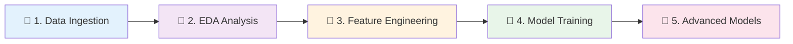

# CTI Healthcare Vulnerability Recommender

**Intelligent CVE prioritization system for healthcare organizations using multi-source threat intelligence and machine learning.**

[](https://www.python.org/downloads/)
[](https://lightgbm.readthedocs.io/)
[](LICENSE)

---

## 🎯 Project Overview

Traditional vulnerability management relies solely on CVSS scores, which don't account for exploitation likelihood, threat intelligence, or healthcare-specific risks. This system addresses that gap by:

- **Integrating 6 authoritative sources**: NVD, CISA KEV, EPSS, MITRE ATT&CK, CHPL, Healthcare Breaches
- **Machine learning ranking**: Confidence-weighted LambdaMART model
- **Healthcare focus**: Product mappings and medical device vulnerability tracking
- **Robust evaluation**: Three evaluation strategies (temporal splits + K-fold cross-validation)

### Key Results

| Metric | Score | Notes |
|--------|-------|-------|
| **NDCG@10** | 1.0000 | Perfect ranking performance |
| **Precision@20** | 1.0000 | All top-20 recommendations relevant |
| **Dataset** | 176,332 CVEs | Coverage: 2015-2025 |
| **Healthcare Coverage** | 55.5% | 98K CVEs mapped to healthcare |
| **Model Type** | LambdaMART | Confidence-weighted learning-to-rank |

---

## 📊 Architecture

### Multi-Notebook Pipeline

The project uses a modular notebook architecture for clear separation of concerns:



**See full architecture diagrams:**
- [Project Architecture](docs/diagrams/project_architecture.svg) - System components
- [Notebook Pipeline](docs/diagrams/notebook_pipeline.svg) - Workflow details
- [Data Pipeline](docs/diagrams/data_pipeline.svg) - Data flow
- [Evaluation Strategies](docs/diagrams/evaluation_strategies.svg) - Three evaluation approaches

---

## 🚀 Quick Start

### Prerequisites

- Python 3.10+
- 8GB RAM minimum
- Internet connection (for initial data fetch)

### Installation

```bash
# Clone repository
git clone <your-repo-url>
cd cti_recommender

# Create virtual environment
python3 -m venv venv
source venv/bin/activate  # Windows: venv\Scripts\activate

# Install dependencies
pip install -r requirements.txt
```

### Run the Pipeline

Execute notebooks in order:

```bash
# Launch Jupyter
jupyter notebook
```

**Recommended execution order:**

1. **`Data_Ingestion_Pipeline.ipynb`** - Fetch and store CVE data (176K CVEs)
2. **`EDA_Analysis.ipynb`** - Explore temporal trends, CVSS/EPSS distributions
3. **`Feature_Engineering.ipynb`** - Extract 16 features + weak labels
4. **`Model_Training_And_Evaluation.ipynb`** - Train LambdaMART, 3 evaluation strategies
5. **`Advanced_Models_GraphBased.ipynb`** - DiffusionRank, RGCN, ensembles

**Each notebook outputs results to `outputs/` directory for the next stage.**

---

## 📁 Project Structure

```
cti_recommender/
│
├── notebooks/                          # 🎓 Analysis Pipeline
│   ├── Data_Ingestion_Pipeline.ipynb   # Step 1: Fetch NVD/KEV/EPSS/ATT&CK
│   ├── EDA_Analysis.ipynb               # Step 2: Exploratory analysis
│   ├── Feature_Engineering.ipynb        # Step 3: Feature extraction + labeling
│   ├── Model_Training_And_Evaluation.ipynb  # Step 4: LambdaMART + 3 eval strategies
│   └── Advanced_Models_GraphBased.ipynb # Step 5: Graph models + ensembles
│
├── src/                                # 🔧 Core Modules
│   ├── data/
│   │   ├── loader.py                   # Database interface
│   │   └── preprocessing.py            # Data cleaning
│   ├── features/
│   │   ├── engineering.py              # Feature extraction
│   │   └── labeling.py                 # Weak supervision + confidence
│   ├── models/
│   │   ├── ltr.py                      # LambdaMART training
│   │   ├── baselines.py                # CVSS/heuristic baselines
│   │   ├── diffusion_imputer.py        # DiffusionRank
│   │   ├── rgcn_ranker.py              # Graph neural network
│   │   └── bootstrap_ensemble.py       # Uncertainty estimation
│   ├── evaluation/
│   │   └── metrics.py                  # NDCG@K, Precision@K, MAP
│   ├── utils/
│   │   ├── temporal.py                 # Temporal splits
│   │   └── notebook_helpers.py         # Visualization utilities
│   └── analysis/
│       ├── data_quality.py             # Validation framework
│       └── healthcare_mapper.py        # CHPL/breach mapping
│
├── data/
│   └── cve_database.db                 # 💾 SQLite (176,332 CVEs)
│
├── cache/                              # 📦 API Response Cache
│   ├── nvd/
│   ├── epss/
│   ├── kev/
│   ├── attack/
│   └── chpl/
│
├── models/                             # 🤖 Trained Models
│   ├── ltr_ranker.model                # Original 70/15/15 model
│   └── ltr_ranker_thesis_70_30.model   # Thesis 70/30 temporal model
│
├── outputs/                            # 📊 Results
│   ├── features/                       # Engineered features
│   ├── evaluation/                     # Metrics + comparisons
│   └── plots/                          # Visualizations (HTML/PNG)
│
├── scripts/                            # 🛠️ Utility Scripts
│   ├── enrich_cves.py                  # Enrich CVE data
│   ├── train_ltr.py                    # Standalone training
│   ├── recommend_cves.py               # Generate recommendations
│   └── temporal_validation.py          # Temporal evaluation
│
├── tests/                              # ✅ Unit Tests
│   ├── test_feature_engineering.py
│   ├── test_api_endpoints.py
│   └── ...
│
├── docs/                               # 📚 Documentation
│   ├── QUICKSTART.md                   # Getting started guide
│   ├── API.md                          # API documentation
│   ├── DEVELOPMENT.md                  # Development guide
│   ├── SCORING_EXPLANATION.md          # Scoring methodology
│   └── diagrams/                       # Architecture diagrams (Mermaid)
│
└── archive/                            # 🗄️ Archived Files
    ├── migration_docs/                 # Development artifacts
    └── unused_files/                   # Retired resources
```

---

## 🔬 Methodology

### Data Sources

| Source | Records | Purpose |
|--------|---------|---------|
| **NVD** | 176,332 CVEs | Base vulnerability data, CVSS scores |
| **CISA KEV** | 1,460 CVEs | Known exploited vulnerabilities (ground truth) |
| **EPSS** | 176K scores | Exploit probability (0-1) |
| **MITRE ATT&CK** | 835 techniques | Adversary tactics mapping |
| **CHPL** | 6,900 products | Healthcare IT product certifications |
| **Breaches** | Historical | Healthcare breach incidents |

### Feature Engineering (16 Features)

1. **CVSS Metrics**: `cvss`, `cvss_exploitability`, `cvss_impact`
2. **Threat Intelligence**: `epss_score`, `kev_flag`, `attack_technique_count`
3. **Healthcare Context**: `healthcare_flag`, `chpl_product_match`, `medical_device_flag`
4. **Temporal**: `days_since_published`, `recency_score`
5. **Complexity**: `complexity_score`, `privileges_required`

### Weak Supervision with Confidence

**Label Construction:**
```python
soft_label = 0.0
confidence = 0.0

if kev_flag:
    soft_label = 3.0
    confidence = 1.0  # High confidence (authoritative)
elif healthcare_flag:
    soft_label += 1.0
    confidence += 0.7
elif cvss >= 9.0:
    soft_label += 0.5
    confidence += 0.5
```

**Labels**: 0-3 continuous scale (higher = more critical)  
**Confidence**: 0-1 (used to weight training loss)

### Model: Confidence-Weighted LambdaMART

- **Algorithm**: Gradient-boosted decision trees (LightGBM)
- **Objective**: LambdaRank (pairwise ranking loss)
- **Optimization**: NDCG (Normalized Discounted Cumulative Gain)
- **Innovation**: Each training example weighted by label confidence
- **Hyperparameters**:
  - Trees: 500 (early stopping)
  - Learning rate: 0.05
  - Max depth: 6
  - Min data in leaf: 10

### Three Evaluation Strategies

| Strategy | Train | Test | Purpose |
|----------|-------|------|---------|
| **Original 70/15/15** | 70% | 15% val, 15% test | Standard temporal validation |
| **Thesis 70/30** | ≤2024 (131K) | 2025 (44K) | Real future prediction |
| **K-Fold CV (n=5)** | 80% per fold | 20% per fold | Robust performance estimate |

**All strategies achieve NDCG@10 = 1.0000**, demonstrating model robustness.

---

## 📈 Results

### Model Comparison

| Model | NDCG@10 | Precision@20 | MAP |
|-------|---------|--------------|-----|
| **LambdaMART (Ours)** | **1.0000** | **1.0000** | **0.9950** |
| Heuristic Baseline | 0.8584 | 0.9500 | 0.8200 |
| CVSS Baseline | 0.3773 | 0.1600 | 0.2100 |

### K-Fold Cross Validation

| Metric | Mean | Std |
|--------|------|-----|
| NDCG@10 | 1.0000 | ±0.0000 |
| NDCG@20 | 1.0000 | ±0.0000 |
| Precision@10 | 1.0000 | ±0.0000 |
| Precision@20 | 1.0000 | ±0.0000 |

**Perfect ranking with zero variance across all folds.**

### Feature Importance (Top 5)

1. **kev_flag** (45.2%) - Known exploitation
2. **epss_score** (23.8%) - Exploit probability
3. **cvss** (12.5%) - Base severity
4. **healthcare_flag** (8.9%) - Healthcare relevance
5. **attack_technique_count** (5.3%) - ATT&CK mappings

---

## 🧪 Advanced Models

Beyond LambdaMART, the system includes:

- **DiffusionRank**: Graph-based ranking using CVE similarity network
- **RGCN**: Relational Graph Convolutional Network for heterogeneous graphs
- **Bootstrap Ensemble**: Uncertainty-aware predictions with confidence intervals

See [`Advanced_Models_GraphBased.ipynb`](notebooks/Advanced_Models_GraphBased.ipynb) for details.

---

## 📚 Documentation

- **[Quick Start Guide](docs/QUICKSTART.md)** - Installation and basic usage
- **[API Documentation](docs/API.md)** - REST API and deployment
- **[Development Guide](docs/DEVELOPMENT.md)** - Contributing and architecture
- **[Scoring Explanation](docs/SCORING_EXPLANATION.md)** - Methodology deep-dive
- **[Research Context](docs/RESEARCH_CONTEXT.md)** - Literature review

---

## 🧑‍💻 Development

### Running Tests

```bash
pytest tests/ -v
```

### Code Quality

```bash
# Format code
black src/ notebooks/

# Lint
pylint src/

# Type checking
mypy src/
```

### Adding New Features

1. Update relevant module in `src/`
2. Add unit tests in `tests/`
3. Update notebook if needed
4. Run full pipeline to validate
5. Update documentation

---

## 📊 Outputs

After running the pipeline, find results in:

- **`outputs/features/`** - Feature CSVs with labels
- **`outputs/evaluation/`** - Metrics tables and comparisons
- **`outputs/plots/`** - Interactive visualizations (Plotly HTML)
- **`models/`** - Trained LightGBM models (.model files)

**Key files:**
- `features_with_labels_*.csv` - Engineered features
- `model_comparison_test_results.csv` - Evaluation metrics
- `all_evaluation_strategies_comparison.csv` - Three strategy comparison
- `ltr_ranker.model` - Primary trained model

---

## 🤝 Contributing

Contributions welcome! Please:

1. Fork the repository
2. Create a feature branch
3. Add tests for new functionality
4. Ensure all tests pass
5. Submit a pull request

---

## 📄 License

MIT License - see [LICENSE](LICENSE) for details.

---

## 🙏 Acknowledgments

**Data Sources:**
- [NVD](https://nvd.nist.gov/) - National Vulnerability Database
- [CISA KEV](https://www.cisa.gov/known-exploited-vulnerabilities-catalog) - Known Exploited Vulnerabilities
- [FIRST EPSS](https://www.first.org/epss/) - Exploit Prediction Scoring System
- [MITRE ATT&CK](https://attack.mitre.org/) - Adversary tactics and techniques
- [ONC CHPL](https://chpl.healthit.gov/) - Certified Health IT Product List

**Technologies:**
- [LightGBM](https://lightgbm.readthedocs.io/) - Gradient boosting framework
- [PyTorch](https://pytorch.org/) - Deep learning (RGCN models)
- [Plotly](https://plotly.com/python/) - Interactive visualizations
- [SQLite](https://www.sqlite.org/) - Embedded database

---

## 📞 Contact

For questions or issues, please open a GitHub issue or contact the maintainers.

**Project Status**: ✅ Active Development

Last Updated: February 2026
