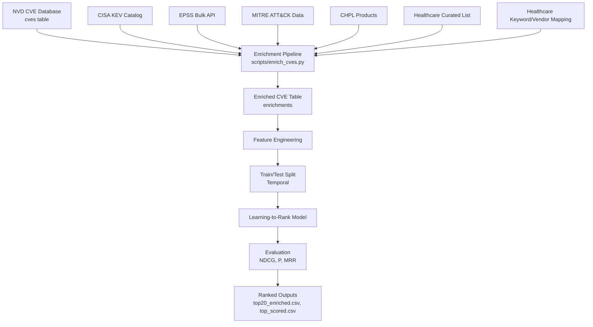

# Examiner Brief: Workflow, Data Science Steps, Outcomes, and Baseline Comparison

Saved: 2026-01-18

This document answers the examiner's three fundamental questions using evidence
from the notebook and project outputs in `outputs/`.

## 1) Detailed data flow diagram

## 2) Data science steps executed

1. **Data collection**
   - Base CVEs from NVD (local SQLite `cves` table).
   - Enrichment sources: CISA KEV, EPSS, MITRE ATT&CK, CHPL, curated healthcare list.

2. **Data processing & cleaning**
   - CVEs normalized and joined by `cve_id`.
   - Missing values handled; coverage and quality validated.

3. **Feature engineering**
   - Exploitation signals: `kev_flag`, `epss_score`, `epss_percentile`.
   - Attacker behavior: `attack_flag`, `attack_technique_count`.
   - Healthcare relevance: `is_healthcare`, `chpl_flag`, curated flags.
   - Temporal signals: recency and days since publication.
   - Interaction features for stronger signals.

4. **Labeling**
   - Multi-level labels created using domain rules and curated positives.

5. **Modeling**
   - Learning-to-Rank model trained with temporal split (train pre-2024, test 2025).
   - Pruned/regularized model produced to reduce leakage and overfitting.

6. **Evaluation & validation**
   - Ranking metrics: NDCG@K, Precision@K, MRR.
   - Ablation study and correlation analysis to verify feature value and redundancy.

7. **Outputs**
   - Ranked CVE lists for actionability (`outputs/top20_enriched.csv` and `outputs/top_scored.csv`).
   - Evaluation reports and model comparison summaries.

## 2.1) Comparison Strategy (Baseline Framing)

Our approach is evaluated against dimensional baselines rather than complete CTI recommender systems. Each baseline represents a distinct prioritization dimension:

| Dimension | Baseline Model | Purpose |
| --- | --- | --- |
| Severity-only | CVSS ranking | Traditional vulnerability scoring without context |
| Exploit likelihood | EPSS ranking | Probabilistic exploitation forecasts |
| Context-aware scoring | CAVP (Critical Asset Vulnerability Prioritization) | Asset-context weighting without ML |
| Attack technique mapping | ATT&CK-based ranking | Adversary behavior signals only |

This framing isolates the value added by multi-source fusion and learning-to-rank optimization. Comparing against full CTI systems would conflate multiple design choices; dimensional baselines clarify which signals drive improvement.

## 3) Outcome and interpretation

**Outcome**
- The system outputs a ranked list of vulnerabilities for healthcare teams.
- Each CVE includes exploitation evidence, attacker technique signals, recency,
  and healthcare relevance.
- Top-K results provide an actionable patching list.

**Interpretation**
- Higher-ranked CVEs are those that are **known exploited**, **likely to be
  exploited**, and **relevant to healthcare**.
- This reduces alert fatigue by prioritizing real-world risk rather than
  severity alone.
- Caution: labels were partially derived from features (label leakage); the
  pruned model is the preferred, more realistic version.

### Relevance of Ranked Output for Healthcare Teams

The ranked list directly supports patching prioritization workflows. High-rank CVEs warrant immediate investigation as they exhibit convergent signals: active exploitation, attacker technique alignment, and healthcare asset relevance. Low-rank CVEs may represent theoretical risks with minimal real-world evidence, suitable for deferred patching cycles. This stratification enables resource-constrained healthcare security teams to focus efforts where adversary activity and organizational exposure intersect, reducing mean-time-to-remediation for critical threats.

## 4) Effectiveness vs CVSS/EPSS-only baselines

Evidence from `outputs/ablation_study_results.csv` and
`outputs/FINAL_MODEL_COMPARISON.txt`:

| Model / Variant | NDCG@10 | Notes |
| --- | --- | --- |
| CVSS-only baseline | 0.6675 | `V1_Baseline_CVSS` |
| + EPSS (multi-source) | 0.9278 | `V3_+EPSS` |
| Pruned LTR (temporal 2025) | 0.7581 | More realistic, reduced leakage |

**Interpretation**
- CVSS-only ranking underperforms multi-source scoring.
- Adding EPSS and exploitation signals significantly improves ranking quality.
- The pruned LTR model sacrifices perfect scores for robustness and better
  generalization to future data.

**Bottom line**
The multi-source LTR approach is more effective than CVSS-only and EPSS-only
signals because it integrates **exploit evidence + attacker behavior + healthcare
context** into a single ranking.

## References to project evidence
- `outputs/ablation_study_results.csv`
- `outputs/FINAL_MODEL_COMPARISON.txt`
- `outputs/top20_enriched.csv`
